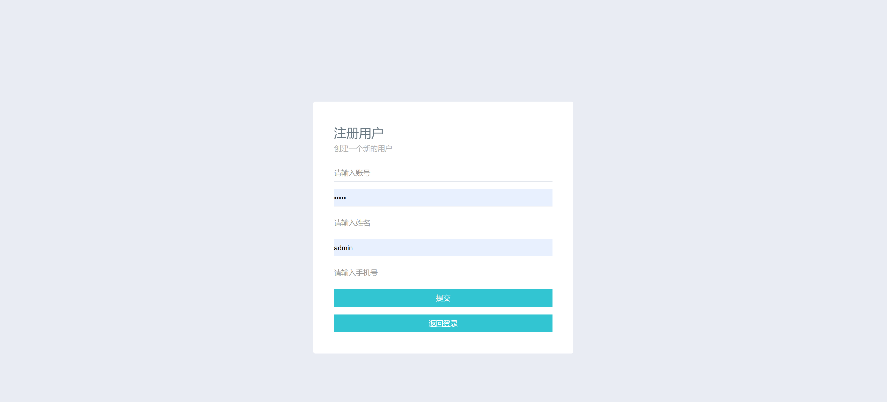

<h1 align="center">图书管理系统</h1>

## 简介
图书管理系统：角色分为管理员、用户；提供用户注册、登录界面、图书管理、分类管理、借阅归还、公告发布、读者信息管理等功能，界面简洁，功能明确，支持高效信息管理。    --计算机毕业设计源码；毕设源码；java毕业设计源码

## 联系方式

<h3 align="center">获取完整代码与数据库文件 + 微信：deepguan QQ: 86050149 QQ群: 783742310</h3>

<h3 align="center">可帮忙远程部署 包运行成功！提供远程部署、修改代码、设计文档指导、代码讲解等服务！</h3>

## 功能介绍（完整见运行截图）
管理员： 登录和注册用户，管理图书、图书分类、借阅和归还信息，发布公告，维护读者信息，查看和修改个人资料，进行资源下载。 用户： 注册账户，登录查看和管理个人借阅信息，修改个人资料和密码，通过导航栏访问图书资源，与管理员沟通，退出账户。

## 运行截图

本代码来源于网络,仅供学习参考使用!

